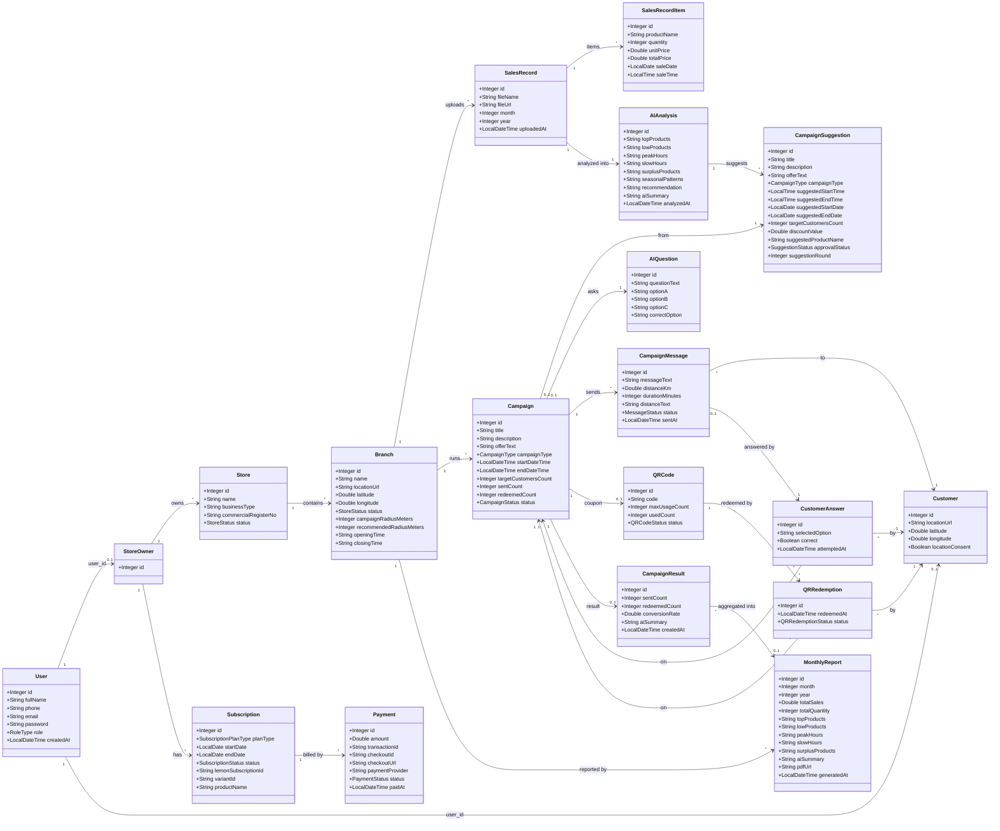
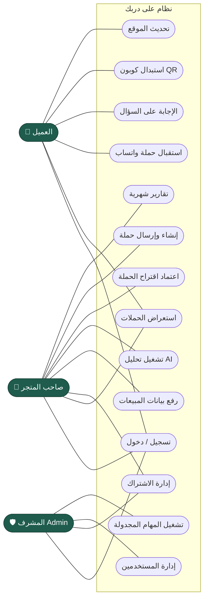

<div align="center">

# 🛍️ على دربك · Ala Darbak

### منصّة تسويق ذكية تحوّل بيانات مبيعات المتجر إلى حملات واتساب مستهدفة جغرافياً ومدعومة بالذكاء الاصطناعي

[]()
[]()
[]()
[]()

</div>

---

# About the Project

## Ala Darbak

**Ala Darbak** is an AI-powered marketing platform designed for small and medium-sized businesses. It connects **sales data**, **geolocation**, and **artificial intelligence** to transform raw sales records into **targeted marketing campaigns** delivered through **WhatsApp**, with discount coupons generated as **QR codes** that can be redeemed at store branches.

**In short:**
The store uploads its sales data → AI analyzes the data and generates a marketing campaign with an interactive question → the campaign is sent via WhatsApp to customers located within the branch radius → customers answer the question and receive a QR discount coupon by email → the coupon is redeemed in-store → campaign performance and results are automatically tracked and reported.

---

# The Problem

* Store owners have access to **sales data**, but often struggle to convert it into **effective marketing decisions**.
* Traditional marketing campaigns are usually **broad and untargeted**, reaching everyone regardless of relevance, which increases costs and reduces effectiveness.
* Businesses lack a simple and efficient way to reach **customers who are actually near their branches**.
* Measuring the **real impact of marketing campaigns** is challenging, including tracking customer reach, engagement, and coupon redemption rates.

---

## 📖 فكرة المشروع

**على دربك** منصّة تسويق ذكية موجّهة للمتاجر الصغيرة والمتوسطة. تربط بين **بيانات المبيعات** و **الموقع الجغرافي** و **الذكاء الاصطناعي** لتحويل أرقام المبيعات الخام إلى **حملات تسويقية مستهدفة** تصل للعميل عبر **واتساب**، مع كوبونات خصم على شكل **QR** تُستبدل في الفرع.

> الفكرة باختصار: المتجر يرفع مبيعاته → الذكاء الاصطناعي يحلّلها ويقترح حملة وسؤال تفاعلي → الحملة تُرسل واتساب للعملاء **داخل نطاق الفرع** → العميل يجاوب فيحصل على كوبون QR بالإيميل → يستبدله في الفرع → تقارير ونتائج تلقائية.

---

## ❗ المشكلة

- أصحاب المتاجر يملكون **بيانات مبيعات** لكن لا يعرفون كيف يحوّلونها إلى **قرارات تسويقية**.
- الحملات التقليدية **عامة وغير مستهدفة** — تُرسل للجميع بلا تمييز، فترتفع التكلفة وتقل النتيجة.
- لا توجد وسيلة سهلة للوصول إلى **العملاء القريبين فعلاً** من الفرع.
- صعوبة قياس **أثر الحملة** (كم وصل؟ كم تفاعل؟ كم استبدل العرض؟).

## ✅ الحل الذي يقدّمه المشروع

| الخطوة | ماذا يحدث |
|--------|-----------|
| 1️⃣ **رفع البيانات** | المتجر يرفع المبيعات (Excel أو Google Sheets) لكل فرع |
| 2️⃣ **تحليل AI** | الذكاء الاصطناعي يكتشف الأنماط: منتجات راكدة، ساعات الذروة، فرص البيع |
| 3️⃣ **اقتراح حملة** | الـ AI يقترح حملة جاهزة + يولّد **سؤالاً تفاعلياً** |
| 4️⃣ **الاستهداف الجغرافي** | تحديد العملاء داخل **نطاق الفرع** (Google Maps) |
| 5️⃣ **الإرسال** | إرسال الحملة عبر **واتساب** (UltraMsg) |
| 6️⃣ **التفاعل والمكافأة** | العميل يجاوب السؤال → يستلم **كوبون QR** بالإيميل |
| 7️⃣ **الاستبدال** | الكاشير يمسح/يتحقق من الكود في الفرع |
| 8️⃣ **القياس** | نتائج الحملة + **تقارير شهرية PDF** تلقائية |

---

## 🧰 التقنيات (Tech Stack) و الـ APIs

### Backend Core
| التقنية | الاستخدام |
|---------|-----------|
| **Java 17** + **Spring Boot 4.1.0** | إطار العمل الأساسي |
| **Spring Web (MVC)** | بناء REST API (~20 Controller) |
| **Spring Data JPA / Hibernate** | الـ ORM والوصول لقاعدة البيانات |
| **Spring Security** + **BCrypt** | مصادقة HTTP Basic + تجزئة كلمات المرور + صلاحيات حسب الدور |
| **Spring Validation** | التحقق من المدخلات (`@Valid`) |
| **Spring Mail** | إرسال الإيميلات (كوبونات QR + التقارير) |
| **MySQL 8** | قاعدة البيانات (19 جدول) |
| **ModelMapper** | تحويل Entity ↔ DTO |
| **Lombok** | تقليل الـ boilerplate |

### المكتبات المتخصصة
| المكتبة | الاستخدام |
|---------|-----------|
| **Apache POI** | قراءة ملفات مبيعات Excel |
| **OpenHTMLtoPDF + PDFBox** | توليد تقارير PDF |
| **ZXing (core + javase)** | توليد صور كود QR |
| **Spring WebFlux (WebClient)** | استدعاء الـ APIs الخارجية |
| **Jackson / org.json** | معالجة JSON |
| **Commons-Codec / Commons-IO** | ترميز + التعامل مع الملفات |

### الـ APIs الخارجية (Integrations)
| الـ API | الغرض |
|---------|-------|
| 🤖 **OpenAI (gpt-4o-mini)** | كل ميزات الذكاء الاصطناعي |
| 💬 **UltraMsg** | إرسال واستقبال رسائل واتساب (Webhook) |
| 🗺️ **Google Maps** | Geocoding + Routes (الاستهداف الجغرافي ونطاق الفرع) |
| 📊 **Google Sheets API** | استيراد بيانات المبيعات من Google Sheets |
| 💳 **LemonSqueezy** | اشتراكات وخطط الدفع (Checkout) — *تُعالَج محلياً* |
| 🏢 **Wathq (واثق)** | التحقق من السجل التجاري لصاحب المتجر |
| 📅 **Public Holidays API** | جلب الإجازات الرسمية لجدولة الحملات |
| 📧 **SMTP / Gmail** | إرسال الإيميلات |
| ⚙️ **n8n** | أتمتة المهام المجدولة (تشغيل الحملات الجاهزة / فحص الاشتراكات المنتهية) |

---

## 🧠 استخدام الذكاء الاصطناعي (AI Usage)

يعتمد المشروع على **OpenAI `gpt-4o-mini`** عبر `OpenAiService` في **5 ميزات** أساسية:

| # | الميزة | الوصف |
|---|--------|-------|
| 1 | **تحليل بيانات المبيعات** | يحلّل المبيعات المرفوعة ويستخرج: المنتجات الأكثر/الأقل مبيعاً، ساعات الذروة، المنتجات الراكدة، الأنماط الموسمية، ومستوى الثقة |
| 2 | **اقتراح الحملات** | يولّد اقتراح حملة جاهزة (عنوان + عرض + جمهور مستهدف) بناءً على نتيجة التحليل |
| 3 | **توليد الأسئلة التفاعلية** | ينشئ سؤالاً (اختيار من متعدد) مرتبطاً بالحملة لزيادة التفاعل |
| 4 | **توصية نطاق الفرع** | يقترح نصف قطر الاستهداف الأمثل حول الفرع |
| 5 | **ملخصات التقارير الشهرية** | يكتب ملخصاً نصياً ذكياً لأداء الفرع داخل التقرير الشهري |

---


### 🟣 رغد البقمي — بيانات المبيعات + تحليل AI + اقتراح الحملات + الإجازات + الحملات + نتائج الحملات (endpoint 65)

النطاق: `SalesRecord`, `SalesRecordItem`, `AIAnalysis`, `CampaignSuggestion`, `Holiday`, `Campaign`, `CampaignResult`

<details open>
<summary><b>AIAnalysis</b> · <code>/api/v1/ai-analysis</code> (29)</summary>

| Method | Path |
|--------|------|
| GET | `/get` |
| GET | `/get/{id}` |
| GET | `/get-by-sales-record/{salesRecordId}` |
| GET | `/peak-hours/{analysisId}` |
| GET | `/slow-hours/{analysisId}` |
| GET | `/confidence/{analysisId}` |
| GET | `/chart/{analysisId}` |
| GET | `/recommendations/{analysisId}` |
| GET | `/top-products/{analysisId}` |
| GET | `/low-products/{analysisId}` |
| GET | `/best-recommendation/{analysisId}` |
| GET | `/total-sales/{analysisId}` |
| GET | `/product-details/{analysisId}` |
| GET | `/summary/{analysisId}` |
| GET | `/surplus-products/{analysisId}` |
| GET | `/seasonal-patterns/{analysisId}` |
| GET | `/ai-summary/{analysisId}` |
| GET | `/suggested-campaign-ready/{analysisId}` |
| GET | `/generated-at/{analysisId}` |
| GET | `/branch-name/{analysisId}` |
| GET | `/sales-record-info/{analysisId}` |
| GET | `/main-opportunity/{analysisId}` |
| GET | `/risk-note/{analysisId}` |
| POST | `/add/sales-record/{salesRecordId}` |
| PUT | `/update/{id}/sales-record/{salesRecordId}` |
| GET | `/latest/branch/{branchId}` |
| GET | `/{analysisId}/dashboard` |
| POST | `/{analysisId}/send-email-summary` |
| DELETE | `/delete/{id}` |
</details>

<details>
<summary><b>CampaignSuggestion</b> · <code>/api/v1/campaign-suggestion</code> (13)</summary>

| Method | Path |
|--------|------|
| GET | `/get` |
| GET | `/get/{id}` |
| GET | `/get-by-ai-analysis/{aiAnalysisId}` |
| POST | `/generate/{aiAnalysisId}` |
| POST | `/regenerate/{aiAnalysisId}` |
| POST | `/add/analysis/{aiAnalysisId}` |
| PUT | `/update/{id}/analysis/{aiAnalysisId}` |
| DELETE | `/delete/{id}` |
| GET | `/approved/analysis/{analysisId}` |
| GET | `/pending/analysis/{analysisId}` |
| PUT | `/approve/{id}` |
| POST | `/{suggestionId}/send-approval-email` |
| PUT | `/reject/{id}` |
</details>

<details>
<summary><b>SalesRecord</b> · <code>/api/v1/sales-record</code> (7)</summary>

| Method | Path |
|--------|------|
| GET | `/get` |
| GET | `/get/{id}` |
| GET | `/get-by-branch/{branchId}` |
| POST | `/add/branch/{branchId}` (Excel multipart) |
| POST | `/import-google-sheet/branch/{branchId}` |
| PUT | `/update/{id}/branch/{branchId}` |
| DELETE | `/delete/{id}` |
</details>

<details>
<summary><b>SalesRecordItem</b> · <code>/api/v1/sales-record-item</code> (6)</summary>

| Method | Path |
|--------|------|
| GET | `/get` |
| GET | `/get/{id}` |
| GET | `/get-by-sales-record/{salesRecordId}` |
| POST | `/add/sales-record/{salesRecordId}` |
| PUT | `/update/{id}/sales-record/{salesRecordId}` |
| DELETE | `/delete/{id}` |
</details>

<details>
<summary><b>Holiday</b> · <code>/api/v1/holidays</code> (2)</summary>

| Method | Path |
|--------|------|
| GET | `/public/{year}/{countryCode}` |
| GET | `/check` |
</details>


<details>
<summary><strong>Campaign</strong> · <code>/api/v1/campaigns</code> (5)</summary>

| Method | Path |
|---|---|
| GET | `/{campaignId}/dashboard` |
| GET | `/{campaignId}/qr-status` |
| GET | `/remaining-coupons/{campaignId}` |
| GET | `/type/{campaignId}` |
| GET | `/source/{campaignId}` |

</details>

<details>
<summary><strong>CampaignResult</strong> · <code>/api/v1/campaign-results</code> (3)</summary>

| Method | Path |
|---|---|
| POST | `/generate-finished` |
| GET | `/{campaignId}/dashboard` |
| GET | `/qr-used/{campaignId}` |

</details>

---

## 🌐 External APIs & Integrations — Raghad Scope

The following external APIs and integrations are used in the sales records, AI analysis, campaign suggestion, holiday checking, and reporting workflow.

| Integration | Type | Purpose | Related Feature |
|------------|------|---------|-----------------|
| 🤖 **OpenAI API** | External API | Used to analyze sales records, detect sales patterns, identify slow hours, generate AI summaries, and suggest smart marketing campaigns. | AIAnalysis + CampaignSuggestion |
| 📅 **Nager.Date API** | External API | Used to retrieve official public holidays based on year and country code. The system uses this data to check campaign dates and improve campaign scheduling. | Holiday |
| 📧 **Email / SMTP Integration** | External Service Integration | Used to send AI analysis summaries, campaign approval emails, QR coupon emails, and campaign/report notifications to store owners or customers. | AIAnalysis Email Summary + CampaignSuggestion Email + QR Coupon |
| 📊 **Google Sheets API** | External API | Used to import sales records directly from Google Sheets and convert rows into sales record items inside the system. | SalesRecord Import |
| 📁 **Excel File Upload** | Internal System Feature | Allows the store owner to upload sales records as an Excel file. The backend reads the file and stores its data as sales record items. This is not an external API; it is handled internally using Apache POI. | SalesRecord Upload |

---

## 🗂️ مخطط الأصناف (Class Diagram)



---

## 🎭 مخطط حالات الاستخدام (Use Case Diagram)

ثلاثة Actors مع حالات استخدام **مشتركة** مربوطة لأكثر من actor:



---

## 🔄 مخطط التدفق (Flowchart) — المشروع الكامل من التسجيل إلى التقرير الشهري

```mermaid
flowchart TD
    %% ===== التسجيل والاشتراك =====
    A1[👤 تسجيل صاحب المتجر<br/>StoreOwner Register] --> A2[التحقق من السجل التجاري<br/>Wathq API]
    A2 --> A3{السجل صحيح؟}
    A3 -- لا --> A1
    A3 -- نعم --> A4[عرض خطط الاشتراك<br/>BASIC / PROFESSIONAL]
    A4 --> A5[الاشتراك في خطة + الدفع<br/>محلي · LemonSqueezy Checkout]
    A5 --> A6{الاشتراك فعّال؟}
    A6 -- لا --> A4

    %% ===== إعداد المتجر =====
    A6 -- نعم --> B1[إنشاء متجر<br/>Create Store]
    B1 --> B2[إنشاء فرع + تحديد الموقع<br/>Create Branch · lat/lng]
    B2 --> B3[ضبط نطاق الحملة<br/>campaignRadiusMeters]

    %% ===== بيانات المبيعات =====
    B3 --> C1[رفع بيانات المبيعات]
    C1 --> C2{مصدر البيانات}
    C2 -- ملف Excel --> C3[رفع Excel<br/>Apache POI]
    C2 -- Google Sheets --> C4[استيراد Sheet<br/>Google Sheets API]
    C3 --> C5[تخزين SalesRecord + Items]
    C4 --> C5

    %% ===== تحليل AI واقتراح الحملة =====
    C5 --> D1[تشغيل تحليل AI<br/>OpenAI gpt-4o-mini]
    D1 --> D2[نتائج: منتجات راكدة · ساعات ذروة<br/>توصيات · ملخص]
    D2 --> D3[توليد اقتراح حملة<br/>AI Campaign Suggestion]
    D3 --> D4{صاحب المتجر يعتمد الاقتراح؟}
    D4 -- يرفض --> D5[إعادة توليد اقتراح<br/>Regenerate]
    D5 --> D3

    %% ===== إنشاء الحملة =====
    D4 -- يعتمد --> E1[إنشاء حملة من الاقتراح<br/>create-from-suggestion]
    E1 --> E2{نوع الحملة}
    E2 -- سؤال تفاعلي --> E3[توليد سؤال AI<br/>AIQuestion]
    E2 -- عرض مباشر --> E4[بدون سؤال]
    E3 --> F1
    E4 --> F1[اعتماد الحملة<br/>Approve Campaign]

    %% ===== الاستهداف والإرسال =====
    F1 --> F2[تحديد العملاء داخل النطاق<br/>Google Maps · المسافة والوقت]
    F2 --> F3[إنشاء رسائل الحملة<br/>CampaignMessage لكل عميل]
    F3 --> F4[الإرسال عبر واتساب<br/>UltraMsg · start-ready]

    %% ===== تفاعل العميل =====
    F4 --> G1{نوع الحملة}
    G1 -- عرض مباشر --> G4[توليد كوبون QR + إرساله بالإيميل<br/>ZXing + SMTP]
    G1 -- سؤال تفاعلي --> G2[العميل يرد على واتساب<br/>Webhook]
    G2 --> G3{الإجابة صحيحة؟}
    G3 -- خطأ --> G3b[رسالة شكر بدون كوبون]
    G3 -- صحيحة --> G4

    %% ===== الاستبدال =====
    G4 --> H1[العميل يصل الفرع]
    H1 --> H2[الكاشير يتحقق من الكود<br/>cashier/check-code]
    H2 --> H3{الكود صالح؟}
    H3 -- لا --> H3b[رفض الاستبدال]
    H3 -- نعم --> H4[تسجيل الاستبدال<br/>QRRedemption + تحديث العدّاد]

    %% ===== النتائج والتقارير =====
    H4 --> I1[احتساب نتائج الحملة<br/>CampaignResult]
    G3b --> I1
    I1 --> I2[تجميع النتائج شهرياً]
    I2 --> I3[توليد التقرير الشهري<br/>MonthlyReport]
    I3 --> I4[ملخص AI + PDF<br/>OpenAI + OpenHTMLtoPDF]
    I4 --> I5[📧 تحميل التقرير<br/>send-email/reportId]

    classDef ai fill:#1F5C4D,color:#fff;
    classDef ext fill:#8a5a00,color:#fff;
    class D1,D3,E3,I4 ai;
    class A2,A5,C4,F2,F4,G4 ext;
```



---

## 🔐 الأدوار والصلاحيات

| الدور | الصلاحيات |
|-------|-----------|
| **CUSTOMER** | استقبال الحملات، الإجابة، استبدال الكوبونات، إدارة موقعه وبياناته |
| **STORE_OWNER** | إدارة المتاجر/الفروع، رفع المبيعات، تحليل AI، إنشاء وإرسال الحملات، الاشتراكات، التقارير |
| **ADMIN** | الإشراف على المستخدمين والاشتراكات وتشغيل المهام النظامية |

المصادقة: **HTTP Basic Auth** (تسجيل الدخول بالإيميل) + كلمات مرور مجزّأة بـ **BCrypt** + فحص ملكية الكائنات على مستوى الخدمات.

---

## 🚀 التشغيل محلياً

```bash
# 1) قاعدة البيانات
CREATE DATABASE ala_db CHARACTER SET utf8mb4 COLLATE utf8mb4_unicode_ci;

# 2) الإعدادات في src/main/resources/application.properties
#    spring.datasource.url=jdbc:mysql://localhost:3306/ala_db
#    (ضع مفاتيح الـ APIs في application-secrets.properties)

# 3) التشغيل
./mvnw spring-boot:run
# التطبيق يعمل على http://localhost:8080
```

> ملاحظة: الجداول تُنشأ تلقائياً عبر `spring.jpa.hibernate.ddl-auto=update`.

---

## ☁️ النشر (Deployment)

منشور على **AWS Elastic Beanstalk** (Corretto 17, SingleInstance) مع قاعدة **RDS MySQL 8** بمنطقة **eu-central-1 (Frankfurt)**.

---

## 🔗 روابط مهمة

| المورد | الرابط |
|--------|--------|
| 📚 **API Documentation (Postman)** | https://documenter.getpostman.com/view/54224451/2sBXwwnT9M |
| 🎨 **Figma Design** | https://www.figma.com/design/iCCIxJsa3QYa11zm4wHHZY/Untitled?node-id=32-304&t=Ap5axML4NqIVtLyC-1 |
| ☁️ **AWS Deployment (Live)** | http://ala-darbak-env.eba-i9vnmum9.eu-central-1.elasticbeanstalk.com |

---

<div align="center">

صُنع بـ ❤️ بواسطة فريق **على دربك** — محمد الرشيد · رهف العمري · رغد البقمي
</div>
